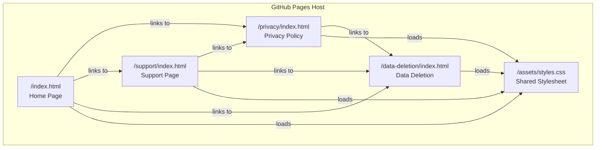

# Design Document: Company Website

## Overview

This design describes a minimal static company website for Onidev LLC, an independent LLC that publishes mobile games and apps on the Apple App Store and Google Play. The website serves four purposes:

1. Satisfy Apple Developer Program organization enrollment expectations (public web presence)
2. Provide a privacy policy URL for App Store Connect and Google Play Console
3. Provide a support URL for both stores
4. Provide a data deletion web resource for Google Play compliance

The site is built as plain HTML/CSS/JS with no frameworks, no build tools, no backend, no cookies, no tracking, and no analytics. It is designed for GitHub Pages hosting with relative links throughout.

### Design Decisions

- **Directory-based routing**: Pages use `/privacy/index.html` rather than `/privacy.html` so that GitHub Pages serves clean URLs (`/privacy/` resolves to `/privacy/index.html`). The existing `.old` files used flat paths like `/privacy.html`; the new structure is more conventional for static hosting.
- **Single shared stylesheet**: All visual styles live in `/assets/styles.css` to eliminate duplication across pages. The `.old` files embedded styles in `<style>` blocks per page.
- **No external dependencies**: System fonts only, no CDN links, no icon libraries, no Google Fonts. This keeps the site fast, private, and free of third-party requests.
- **Placeholders pre-filled**: Rather than leaving bracket tokens in rendered content, all placeholders are pre-filled with real values (Onidev LLC, support@onidev.io, etc.). The source files use HTML comments near each value to mark them as placeholder-derived for easy grep/replace if values change.
- **Descriptive provider placeholders**: Analytics and crash reporting providers are referenced with descriptive text ("an analytics provider", "a crash reporting provider") since providers haven't been finalized.

## Architecture

The website is a flat collection of static files with no build step, no templating engine, and no JavaScript framework.



### Page Relationship

Every page shares:
- A `<header>` with navigation (brand link + 4 nav links)
- A `<footer>` with copyright, contact email, and links to Privacy, Support, and Data Deletion
- The shared stylesheet loaded via `<link rel="stylesheet" href="...">` with a relative path

### Relative Link Strategy

Since pages live at different directory depths, relative paths must account for nesting:

| From Page | To `/index.html` | To `/assets/styles.css` | To `/privacy/` |
|---|---|---|---|
| `/index.html` | `./` | `./assets/styles.css` | `./privacy/` |
| `/privacy/index.html` | `../` | `../assets/styles.css` | (self) |
| `/support/index.html` | `../` | `../assets/styles.css` | `../privacy/` |
| `/data-deletion/index.html` | `../` | `../assets/styles.css` | `../privacy/` |

## Components and Interfaces

### 1. Shared Stylesheet (`/assets/styles.css`)

The single CSS file defines all visual styles for the site.

**CSS Custom Properties (Design Tokens):**

```css
:root {
  --bg: #f7f7f2;       /* Page background — warm off-white */
  --text: #171717;      /* Primary text — near-black */
  --muted: #616161;     /* Secondary text — medium gray */
  --card: #ffffff;      /* Card/content background — white */
  --border: #e4e4dc;    /* Borders and dividers — light warm gray */
  --accent: #222222;    /* Links and interactive elements — dark */
}
```

**Typography:**
- Font stack: `system-ui, -apple-system, BlinkMacSystemFont, "Segoe UI", sans-serif`
- Base line-height: 1.6 for body text, tighter for headings
- Font sizes use `clamp()` for fluid scaling on headings, fixed `rem` units for body text

**Layout:**
- Max content width: 920px, centered with `margin: 0 auto`
- Content card: white background, 1px border, 24px border-radius, subtle box-shadow
- Card padding: 48px on desktop, 30px on mobile (≤640px)
- Page padding: 32px vertical, 20px horizontal

**Responsive Breakpoints:**
- Single breakpoint at 640px for mobile adjustments
- Navigation uses flexbox with `flex-wrap: wrap` for natural reflow
- Heading sizes use `clamp()` for smooth scaling between 320px and 1440px

**Component Styles:**
- `.brand` — Bold, undecorated link for company name in nav
- `.links` — Flex container for nav links with hover underline effect
- `.card` — White content container with border and shadow
- `.eyebrow` — Uppercase, muted, small text for section labels
- `.section` — Content section with top border separator
- `.updated` — Muted date text for privacy policy effective date

### 2. Shared Navigation Component

Each HTML page includes an identical `<header>` block (no templating — literally duplicated):

```html
<header>
  <nav aria-label="Main navigation">
    <a class="brand" href="{relative-path-to-root}">Onidev LLC</a>
    <div class="links">
      <a href="{relative-path-to-root}">Home</a>
      <a href="{relative-path-to-root}privacy/">Privacy</a>
      <a href="{relative-path-to-root}support/">Support</a>
      <a href="{relative-path-to-root}data-deletion/">Data Deletion</a>
    </div>
  </nav>
</header>
```

Where `{relative-path-to-root}` is `./` for the root page and `../` for subdirectory pages.

### 3. Shared Footer Component

Each HTML page includes an identical `<footer>` block:

```html
<footer>
  <div class="footer-content">
    <p>
      &copy; <span id="year"></span> Onidev LLC. All rights reserved.
    </p>
    <p>
      <a href="mailto:support@onidev.io">support@onidev.io</a>
    </p>
    <p class="footer-links">
      <a href="{relative-path-to-root}privacy/">Privacy</a> &middot;
      <a href="{relative-path-to-root}support/">Support</a> &middot;
      <a href="{relative-path-to-root}data-deletion/">Data Deletion</a>
    </p>
  </div>
</footer>
<script>
  document.getElementById("year").textContent = new Date().getFullYear();
</script>
```

### 4. Home Page (`/index.html`)

**Structure:**

```
<header> — shared navigation
<main>
  <article class="card">
    <p class="eyebrow"> — "Independent App & Game Publisher"
    <h1> — "Onidev LLC"
    <p> — Introductory paragraph (location, business activity)
    <section> — "What We Make" (word puzzle games, general audiences)
    <section> — "Player Support" (link + email)
    <section> — "Privacy" (link to privacy page)
    <section> — "Data Deletion" (link to data deletion page)
    <section> — "Contact" (support email)
  </article>
</main>
<footer> — shared footer
```

**Content Notes:**
- Hero heading uses `clamp(2.2rem, 6vw, 4.4rem)` for fluid sizing
- "What We Make" describes general category (word puzzle games for general audiences) without naming specific titles
- No stock photography, hero images, or decorative graphics
- Does not expose the owner's personal legal name
- Does not reference specific app names or unreleased projects

### 5. Privacy Page (`/privacy/index.html`)

**Structure:**

```
<header> — shared navigation
<main>
  <article class="card">
    <h1> — "Privacy Policy"
    <p class="updated"> — "Effective: May 6, 2026"
    <section> — 1. Introduction
    <section> — 2. Who We Are
    <section> — 3. Information We Do Not Directly Collect
    <section> — 4. Information Processed to Operate Our Games and Apps
      - Player identifiers
      - In-game profile information
      - Gameplay data
      - Purchase and entitlement information
      - Device and technical data
      - Advertising and analytics data
    <section> — 5. How We Use Information
    <section> — 6. Service Providers
      - Unity Gaming Services
      - Unity LevelPlay
      - Apple and Google platform services
      - Analytics provider (placeholder)
      - Crash reporting provider (placeholder)
    <section> — 7. Advertising
    <section> — 8. Analytics and Game Balancing
    <section> — 9. Cloud Save, Profiles, Leaderboards, and Friends
    <section> — 10. Purchases
    <section> — 11. Data Retention
    <section> — 12. Data Deletion and Account Requests
    <section> — 13. Children
    <section> — 14. Security
    <section> — 15. International Users
    <section> — 16. Changes to This Policy
    <section> — 17. Contact
  </article>
</main>
<footer> — shared footer
```

**Content Notes:**
- 17 sections total (introduction + 16 content sections as specified in requirements)
- Data categories described at category/service level, not individual SDK package names
- Analytics and crash reporting providers use descriptive placeholder text
- Plain, factual tone without defensive language or legalese
- No excessive legal boilerplate

### 6. Support Page (`/support/index.html`)

**Structure:**

```
<header> — shared navigation
<main>
  <article class="card">
    <h1> — "Support"
    <p> — Brief introductory statement
    <section> — "Contact Us" (support email as primary method)
    <section> — "What to Include" (app name, device, OS, issue description)
    <section> — "Purchases and Refunds" (Apple/Google handle purchases)
    <section> — "Privacy and Data Requests" (links to privacy + data deletion)
    <section> — "Response Time" (expectation statement)
  </article>
</main>
<footer> — shared footer
```

### 7. Data Deletion Page (`/data-deletion/index.html`)

**Structure:**

```
<header> — shared navigation
<main>
  <article class="card">
    <h1> — "Data Deletion"
    <p> — Brief introduction explaining purpose
    <section> — "How to Request Data Deletion" (email + what to include)
    <section> — "What Data May Be Deleted"
    <section> — "What Data May Be Retained" (anonymized analytics, platform purchase records)
    <section> — "Purchase History" (warning about Apple/Google records)
    <section> — "Identity Verification"
    <section> — "Processing Time"
  </article>
</main>
<footer> — shared footer
```

## Data Models

This is a static website with no backend, no database, and no dynamic data. There are no data models in the traditional sense.

**Static Content Model:**

Each HTML page follows a consistent document structure:

| Element | Purpose |
|---|---|
| `<!DOCTYPE html>` | HTML5 doctype |
| `<html lang="en">` | Language declaration |
| `<head>` | Meta tags, title, stylesheet link |
| `<header>` | Shared navigation |
| `<main>` | Page-specific content in `<article class="card">` |
| `<footer>` | Shared footer with dynamic year |
| `<script>` | Year injection (single line) |

**Placeholder Values (Pre-filled):**

| Placeholder | Pre-filled Value | Used In |
|---|---|---|
| `[COMPANY_LEGAL_NAME]` | Onidev LLC | All pages |
| `[SUPPORT_EMAIL]` | support@onidev.io | All pages |
| `[EFFECTIVE_DATE]` | May 6, 2026 | Privacy page |
| `[COMPANY_COUNTRY_OR_STATE]` | Maryland, USA | Home page, Privacy page |
| Analytics provider | "an analytics provider" (descriptive text) | Privacy page |
| Crash reporting provider | "a crash reporting provider" (descriptive text) | Privacy page |

## Error Handling

Since this is a static website with no backend and minimal JavaScript, error handling is limited to:

### JavaScript Graceful Degradation
- The only JavaScript is `document.getElementById("year").textContent = new Date().getFullYear();`
- If JavaScript is disabled, the `<span id="year"></span>` renders empty, and the copyright line reads "© Onidev LLC" without a year — acceptable degradation
- No other functionality depends on JavaScript

### Link Integrity
- All internal links use relative paths and point to `index.html` files within known directories
- Broken links would only occur if files are moved or deleted after generation
- External links are limited to `mailto:` links to the support email

### Missing Stylesheet
- If `/assets/styles.css` fails to load, pages render as unstyled but readable semantic HTML
- Content remains fully accessible without CSS

### 404 Handling
- GitHub Pages serves its default 404 page for unrecognized routes
- No custom 404 page is included (out of scope for this minimal site)

## Testing Strategy

### Why Property-Based Testing Does Not Apply

This feature is a static HTML/CSS/JS website with no backend logic, no data transformations, no parsers, no serializers, and no business logic functions. The only JavaScript is a single line that sets the copyright year. There are no pure functions with meaningful input/output behavior, and no universal properties that vary across inputs. Property-based testing is not appropriate here.

### Recommended Testing Approach

**1. HTML Validation (Automated)**
- Validate all 4 HTML files against the W3C HTML5 specification
- Verify all files use valid semantic HTML elements
- Check for proper `lang`, `charset`, and `viewport` meta tags

**2. Link Checking (Automated)**
- Verify all internal relative links resolve to existing files
- Verify all `mailto:` links have valid email format
- Verify stylesheet `<link>` tags point to the correct relative path from each page's depth

**3. Content Verification (Manual/Automated)**
- Verify each page contains required sections per requirements
- Verify placeholder values are pre-filled correctly
- Verify no `[PLACEHOLDER]` bracket tokens appear in rendered content
- Verify no `APP_NAME` token appears anywhere
- Verify the owner's personal legal name does not appear

**4. Accessibility Checks (Automated + Manual)**
- Verify `aria-label` attributes on `<nav>` elements
- Verify heading hierarchy (single `<h1>` per page, logical `<h2>` structure)
- Verify sufficient color contrast ratios (WCAG AA minimum)
- Verify all interactive elements are keyboard accessible
- Note: Full WCAG compliance validation requires manual testing with assistive technologies

**5. Responsive Layout Testing (Manual)**
- Test at 320px, 640px, 768px, 1024px, and 1440px viewport widths
- Verify navigation wraps without overflow on narrow viewports
- Verify card padding adjusts at the 640px breakpoint
- Verify text remains readable at all sizes

**6. Cross-Browser Smoke Testing (Manual)**
- Test in Safari (primary for Apple review), Chrome, and Firefox
- Verify system font stack renders appropriately in each browser
- Verify CSS custom properties are supported (all modern browsers)

**7. GitHub Pages Deployment Verification (Manual)**
- Verify all pages load correctly when served from GitHub Pages
- Verify relative links work from the deployed domain
- Verify clean URLs (`/privacy/` resolves to `/privacy/index.html`)
